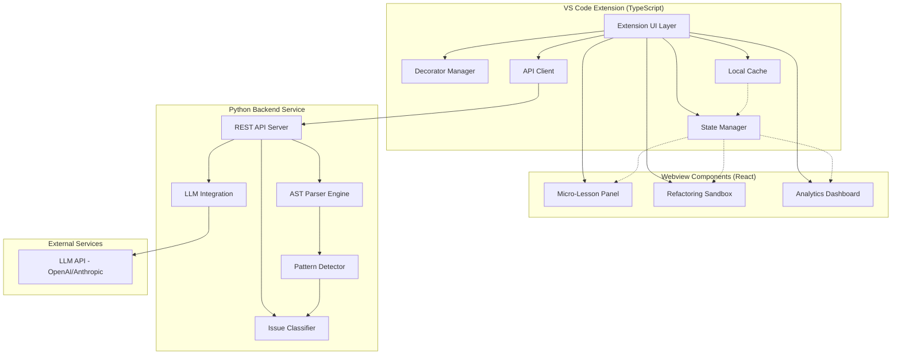
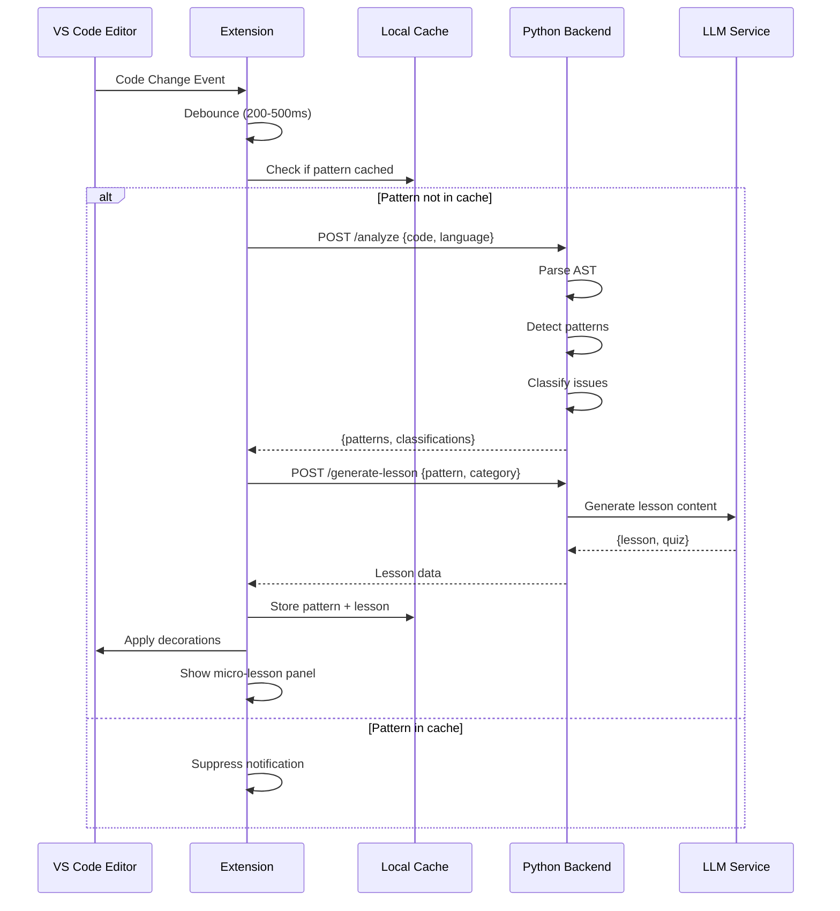

# Design Document: CodeSensei

## Overview

CodeSensei is an AI-driven refactoring coach implemented as a VS Code extension with a Python backend service. The system architecture follows a client-server model where the VS Code extension handles UI/UX and IDE integration, while the Python backend performs heavy computational tasks like AST analysis and LLM-based content generation.

The extension monitors code changes in real-time, detects learning opportunities through pattern matching and AST analysis, and delivers personalized educational content through an interactive side panel. The design emphasizes performance, user experience, and educational effectiveness.

### Key Design Principles

1. **Non-intrusive Learning**: Provide feedback without disrupting the developer's flow
2. **Performance First**: Ensure analysis happens asynchronously without blocking the IDE
3. **Contextual Education**: Generate lessons based on actual user code, not generic examples
4. **Progressive Disclosure**: Show information at the right time and in the right amount
5. **Offline Capability**: Core features work without backend connectivity (degraded mode)

## Architecture

### System Architecture



### Component Interaction Flow



## Components and Interfaces

### 1. VS Code Extension Layer

**Extension Activation**
- Activates on workspace open for supported languages (TypeScript, JavaScript, Python)
- Registers commands, decorators, and webview providers
- Initializes local cache and state management
- Establishes connection to backend service

**Key Components:**

**Decorator Manager**
- Manages gutter icons and inline decorations
- Color codes by issue category:
  - Syntax Basics: Blue
  - Logic Clarity: Yellow
  - Performance: Orange
  - Readability: Green
  - Security: Red
- Provides hover tooltips with brief descriptions
- Handles click events to open micro-lessons

**State Manager**
- Maintains current learning moments
- Tracks user progress and analytics
- Manages extension settings
- Coordinates between components

**API Client**
- HTTP client for backend communication
- Implements retry logic with exponential backoff
- Handles timeout (5 seconds for analysis, 10 seconds for lesson generation)
- Provides fallback behavior when backend unavailable

### 2. Webview Components (React)

**Micro-Lesson Panel**

Interface:
```typescript
interface MicroLesson {
  id: string;
  category: IssueCategory;
  title: string;
  beforeCode: string;
  afterCode: string;
  explanations: string[]; // 2-3 bullet points
  quiz: Quiz;
  detectedAt: Date;
}

interface Quiz {
  question: string;
  options: QuizOption[];
  correctAnswerIndex: number;
  explanation: string;
}

interface QuizOption {
  text: string;
  isCorrect: boolean;
}
```

Features:
- Syntax-highlighted code snippets using Monaco Editor
- Diff view showing before/after changes
- Interactive quiz with immediate feedback
- "Apply Refactoring" button
- "Dismiss" and "Remind Me Later" actions

**Refactoring Sandbox**

Interface:
```typescript
interface RefactoringVariant {
  id: string;
  title: string;
  code: string;
  tradeoffs: Tradeoff[];
  metrics: RefactoringMetrics;
}

interface Tradeoff {
  dimension: 'Readability' | 'Performance' | 'Maintainability' | 'Simplicity';
  score: number; // 1-5
  explanation: string;
}

interface RefactoringMetrics {
  linesChanged: number;
  cyclomaticComplexityDelta: number;
  estimatedPerformanceImpact: string;
}
```

Features:
- Side-by-side comparison of variants
- Trade-off radar chart visualization
- One-click apply with undo support
- "Explain More" button for detailed rationale

**Analytics Dashboard**

Interface:
```typescript
interface UserProgress {
  skillTags: SkillProgress[];
  metrics: ProgressMetrics;
  timeline: TimelineEntry[];
  achievements: Achievement[];
}

interface SkillProgress {
  tag: string; // 'OOP', 'Error Handling', etc.
  level: number; // 1-10
  lessonsCompleted: number;
  quizzesCorrect: number;
  quizzesTotal: number;
}

interface ProgressMetrics {
  linesSaved: number;
  complexityImproved: number;
  refactoringsApplied: number;
  learningStreak: number; // consecutive days
}

interface TimelineEntry {
  date: Date;
  events: ProgressEvent[];
}
```

Features:
- Skill tag progress bars with levels
- Metrics cards (Lines Saved, Complexity Improved)
- 30-day timeline chart
- Achievement badges
- Export/import progress data

### 3. Python Backend Service

**Technology Stack:**
- FastAPI for REST API server
- Tree-sitter for AST parsing (supports multiple languages)
- Scikit-learn for pattern classification (if ML-based)
- OpenAI/Anthropic SDK for LLM integration
- Redis for caching (optional, for production)

**REST API Endpoints:**

```python
# Analysis endpoint
POST /api/v1/analyze
Request:
{
  "code": string,
  "language": "typescript" | "javascript" | "python",
  "filePath": string,
  "cursorPosition": { "line": number, "column": number }
}
Response:
{
  "patterns": [
    {
      "id": string,
      "type": "long_function" | "magic_number" | "nested_loop" | "duplicated_code",
      "location": { "start": Position, "end": Position },
      "severity": "low" | "medium" | "high",
      "category": IssueCategory,
      "confidence": number // 0-1
    }
  ],
  "analysisTime": number // milliseconds
}

# Lesson generation endpoint
POST /api/v1/generate-lesson
Request:
{
  "pattern": Pattern,
  "originalCode": string,
  "language": string,
  "userLevel": "beginner" | "intermediate" | "advanced"
}
Response:
{
  "lesson": MicroLesson,
  "generationTime": number
}

# Refactoring variants endpoint
POST /api/v1/generate-refactorings
Request:
{
  "code": string,
  "language": string,
  "context": string, // surrounding code
  "constraints": string[] // user preferences
}
Response:
{
  "variants": RefactoringVariant[],
  "generationTime": number
}

# Health check
GET /api/v1/health
Response:
{
  "status": "healthy" | "degraded",
  "version": string,
  "llmAvailable": boolean
}
```

**AST Parser Engine**

Uses Tree-sitter for language-agnostic parsing:
- Incremental parsing for performance
- Error-tolerant parsing (works with incomplete code)
- Query system for pattern detection

Pattern Detection Queries:
```scheme
; Long function detection (TypeScript/JavaScript)
(function_declaration
  name: (identifier) @func_name
  body: (statement_block) @body
  (#match? @body ".*\\n.*\\n.*\\n.*\\n.*\\n.*\\n.*\\n.*\\n.*\\n.*\\n.*\\n.*\\n.*\\n.*\\n.*\\n.*\\n.*\\n.*\\n.*\\n.*\\n.*\\n.*\\n.*\\n.*\\n.*\\n.*\\n.*\\n.*\\n.*\\n.*\\n.*\\n.*\\n.*\\n.*\\n.*\\n.*\\n.*\\n.*\\n.*\\n.*\\n.*\\n.*\\n.*\\n.*\\n.*\\n.*\\n.*\\n.*\\n.*\\n.*\\n.*"))

; Magic number detection
(number) @magic_number
(#not-has-parent? @magic_number variable_declarator)
(#not-has-parent? @magic_number enum_assignment)

; Nested loop detection
(for_statement
  body: (statement_block
    (for_statement) @inner_loop))
```

**Issue Classifier**

Classification logic:
```python
class IssueClassifier:
    def classify(self, pattern: Pattern) -> IssueCategory:
        # Rule-based classification
        rules = {
            'long_function': self._classify_long_function,
            'magic_number': self._classify_magic_number,
            'nested_loop': self._classify_nested_loop,
            'duplicated_code': self._classify_duplicated_code,
        }
        
        classifier_func = rules.get(pattern.type)
        if classifier_func:
            return classifier_func(pattern)
        
        # Fallback to ML-based classification if available
        return self._ml_classify(pattern)
    
    def _classify_long_function(self, pattern: Pattern) -> IssueCategory:
        # Long functions typically indicate logic clarity issues
        return IssueCategory.LOGIC_CLARITY
    
    def _classify_magic_number(self, pattern: Pattern) -> IssueCategory:
        # Magic numbers are readability issues
        return IssueCategory.READABILITY
    
    def _classify_nested_loop(self, pattern: Pattern) -> IssueCategory:
        # Nested loops are performance concerns
        return IssueCategory.PERFORMANCE
    
    def _classify_duplicated_code(self, pattern: Pattern) -> IssueCategory:
        # Duplicated code affects maintainability
        return IssueCategory.LOGIC_CLARITY
```

**LLM Integration**

Prompt templates for lesson generation:
```python
LESSON_GENERATION_PROMPT = """
You are CodeSensei, an expert programming instructor. A student has written code with a {category} issue.

Original Code:
```{language}
{code}
```

Issue Detected: {pattern_type}
Issue Description: {pattern_description}

Generate a micro-lesson with:
1. A brief title (5-7 words)
2. An improved version of the code
3. 2-3 bullet points explaining why the improvement matters
4. A 30-second multiple-choice quiz (3-4 options) testing understanding

Format your response as JSON matching this schema:
{schema}

Keep explanations concise and encouraging. Focus on practical benefits.
"""

REFACTORING_GENERATION_PROMPT = """
You are CodeSensei, an expert code refactoring advisor. A student wants to refactor this code:

```{language}
{code}
```

Context:
{context}

Generate 1-3 refactoring variants that are functionally equivalent but differ in approach.
For each variant, provide:
1. The refactored code
2. Trade-off scores (1-5) for: Readability, Performance, Maintainability, Simplicity
3. Brief explanations for each trade-off
4. Estimated metrics (lines changed, complexity delta)

Format as JSON matching this schema:
{schema}

Ensure all variants are syntactically correct and preserve functionality.
"""
```

## Data Models

### Extension Storage Schema

**Local Cache (VS Code Workspace Storage)**
```typescript
interface CacheEntry {
  patternId: string;
  fileUri: string;
  location: Range;
  timestamp: Date;
  expiresAt: Date;
  dismissed: boolean;
  lessonShown: boolean;
}

interface CacheStore {
  entries: Map<string, CacheEntry>;
  maxSize: number; // 10MB
  version: string;
}
```

**User Progress (VS Code Global Storage)**
```typescript
interface UserProgressStore {
  version: string;
  userId: string; // anonymous UUID
  skillTags: Map<string, SkillProgress>;
  metrics: ProgressMetrics;
  timeline: TimelineEntry[];
  achievements: Achievement[];
  settings: UserSettings;
  lastSyncedAt: Date;
}

interface UserSettings {
  mode: 'aggressive' | 'gentle';
  disabledCategories: IssueCategory[];
  minFunctionLength: number;
  quizEnabled: boolean;
  notificationFrequency: 'high' | 'medium' | 'low';
}
```

### Backend Data Models

**Pattern Detection**
```python
from dataclasses import dataclass
from enum import Enum
from typing import List, Optional

class PatternType(Enum):
    LONG_FUNCTION = "long_function"
    MAGIC_NUMBER = "magic_number"
    NESTED_LOOP = "nested_loop"
    DUPLICATED_CODE = "duplicated_code"
    MISSING_ERROR_HANDLING = "missing_error_handling"
    INEFFICIENT_ALGORITHM = "inefficient_algorithm"

class IssueCategory(Enum):
    SYNTAX_BASICS = "Syntax Basics"
    LOGIC_CLARITY = "Logic Clarity"
    PERFORMANCE = "Performance"
    READABILITY = "Readability"
    SECURITY = "Security"

@dataclass
class Position:
    line: int
    column: int

@dataclass
class Range:
    start: Position
    end: Position

@dataclass
class Pattern:
    id: str
    type: PatternType
    location: Range
    severity: str  # 'low', 'medium', 'high'
    category: IssueCategory
    confidence: float  # 0.0 to 1.0
    metadata: dict  # Additional pattern-specific data
```

**Lesson Content**
```python
@dataclass
class QuizOption:
    text: str
    is_correct: bool

@dataclass
class Quiz:
    question: str
    options: List[QuizOption]
    correct_answer_index: int
    explanation: str

@dataclass
class MicroLesson:
    id: str
    category: IssueCategory
    title: str
    before_code: str
    after_code: str
    explanations: List[str]  # 2-3 items
    quiz: Quiz
    detected_at: str  # ISO timestamp
    language: str
```

### API Contract

**Request/Response Models**
```typescript
// Extension -> Backend
interface AnalyzeRequest {
  code: string;
  language: 'typescript' | 'javascript' | 'python';
  filePath: string;
  cursorPosition?: { line: number; column: number };
}

interface AnalyzeResponse {
  patterns: Pattern[];
  analysisTime: number;
}

interface GenerateLessonRequest {
  pattern: Pattern;
  originalCode: string;
  language: string;
  userLevel: 'beginner' | 'intermediate' | 'advanced';
}

interface GenerateLessonResponse {
  lesson: MicroLesson;
  generationTime: number;
}

interface GenerateRefactoringsRequest {
  code: string;
  language: string;
  context: string;
  constraints: string[];
}

interface GenerateRefactoringsResponse {
  variants: RefactoringVariant[];
  generationTime: number;
}
```

## Correctness Properties

*A property is a characteristic or behavior that should hold true across all valid executions of a system—essentially, a formal statement about what the system should do. Properties serve as the bridge between human-readable specifications and machine-verifiable correctness guarantees.*


### Pattern Detection Properties

**Property 1: Long function detection threshold**
*For any* function in supported languages, if the function body contains more than 50 lines of code, the AST_Parser should detect it as a long function pattern, and if it contains 50 or fewer lines, it should not be detected.
**Validates: Requirements 1.3**

**Property 2: Magic number detection accuracy**
*For any* numeric literal in code, if it appears outside of a variable declaration or enum assignment, the AST_Parser should detect it as a magic number, and if it appears within a constant declaration or enum, it should not be detected.
**Validates: Requirements 1.4**

**Property 3: Nested loop detection**
*For any* code containing loop structures, if a loop is nested inside another loop, the AST_Parser should detect it as an inefficient nested loop pattern.
**Validates: Requirements 1.5**

**Property 4: Code duplication detection threshold**
*For any* code file, if two or more blocks contain 5 or more identical consecutive lines, the AST_Parser should detect it as duplicated code.
**Validates: Requirements 1.6**

**Property 5: Parser error resilience**
*For any* code with syntax errors, the AST_Parser should handle the parsing failure gracefully without crashing and should continue to accept subsequent parse requests.
**Validates: Requirements 1.7**

**Property 6: Incremental parsing efficiency**
*For any* code file that is modified, if only a subset of the file changes, the AST_Parser should only re-analyze the changed sections and not the entire file.
**Validates: Requirements 8.1**

### Classification Properties

**Property 7: Single category assignment**
*For any* detected code pattern, the Issue_Classifier should assign it to exactly one issue category (not zero, not multiple).
**Validates: Requirements 2.1**

**Property 8: Low confidence classification handling**
*For any* pattern classification with confidence below 0.7, the Issue_Classifier should still assign a category and should log the low confidence score.
**Validates: Requirements 2.7**

**Property 9: Category color uniqueness**
*For any* two different issue categories, they should be assigned distinct colors in the decorator system.
**Validates: Requirements 4.5**

### Lesson Content Properties

**Property 10: Micro-lesson completeness**
*For any* generated micro-lesson, it should contain: a before code snippet, an after code snippet that differs from the before snippet, 2-3 explanation bullet points, and a quiz with 3-4 options where exactly one option is marked correct.
**Validates: Requirements 3.2, 3.3, 3.4, 3.5**

**Property 11: Quiz feedback provision**
*For any* quiz submission, the system should provide feedback indicating whether the answer was correct or incorrect.
**Validates: Requirements 3.6**

**Property 12: Correct answer tracking**
*For any* quiz where the user selects the correct answer, the Learning_Analytics_Dashboard should increment the corresponding skill tag's correct answer count.
**Validates: Requirements 3.7**

### Visual Highlighting Properties

**Property 13: Learning moment decoration**
*For any* detected learning moment, the CodeSensei_Extension should apply both a gutter icon and an inline decoration at the corresponding code location.
**Validates: Requirements 4.1, 4.2**

### Refactoring Properties

**Property 14: Refactoring variant count**
*For any* refactoring request, the Refactoring_Sandbox should return between 1 and 3 refactoring variants (inclusive).
**Validates: Requirements 5.2**

**Property 15: Variant trade-off completeness**
*For any* refactoring variant, it should include trade-off scores for all four dimensions: Readability, Performance, Maintainability, and Simplicity.
**Validates: Requirements 5.3, 5.4**

**Property 16: Refactoring application correctness**
*For any* selected refactoring variant, when applied, the editor content should be updated to match the variant's code exactly.
**Validates: Requirements 5.6**

**Property 17: Refactoring undo support**
*For any* applied refactoring, invoking the editor's undo command should restore the code to its state before the refactoring was applied.
**Validates: Requirements 5.7**

**Property 18: Refactoring syntactic correctness**
*For any* generated refactoring variant, parsing the variant code should succeed without syntax errors.
**Validates: Requirements 5.8**

### Caching Properties

**Property 19: Cache entry creation**
*For any* learning moment that is displayed or dismissed, the Local_Cache should create an entry recording the pattern, location, and action taken.
**Validates: Requirements 6.1, 6.4**

**Property 20: Cached pattern suppression**
*For any* code pattern that exists in the cache for a given location, the CodeSensei_Extension should not display a notification for that pattern at that location.
**Validates: Requirements 6.2**

**Property 21: Cache expiration**
*For any* cache entry, if 7 days have elapsed since its creation timestamp, it should be considered expired and should not suppress notifications.
**Validates: Requirements 6.3**

**Property 22: Cache size limit enforcement**
*For any* cache that exceeds 10MB in size, adding a new entry should trigger removal of the oldest entries until the cache is under the size limit.
**Validates: Requirements 6.6**

### Analytics Properties

**Property 23: Analytics update on user actions**
*For any* user action (quiz completion or refactoring application), the Learning_Analytics_Dashboard should update the corresponding metrics (skill progress, lines saved, or complexity improved).
**Validates: Requirements 7.2, 7.6**

**Property 24: Lines saved calculation**
*For any* applied refactoring, if the refactored code has fewer lines than the original, the difference should be added to the cumulative "Lines Saved" metric.
**Validates: Requirements 7.3**

**Property 25: Complexity improvement tracking**
*For any* applied refactoring, if the refactored code has lower cyclomatic complexity than the original, the difference should be added to the "Cyclomatic Complexity Improved" metric.
**Validates: Requirements 7.4**

**Property 26: Timeline data filtering**
*For any* timeline query, only events from the last 30 days should be included in the returned timeline data.
**Validates: Requirements 7.5**

**Property 27: Analytics persistence**
*For any* analytics data, it should be persisted to storage and should be retrievable after the extension is reloaded.
**Validates: Requirements 7.7**

### Performance Properties

**Property 28: Concurrent request limiting**
*For any* workspace, if more than 3 analysis requests are made concurrently, the additional requests should be queued and processed after earlier requests complete.
**Validates: Requirements 8.4**

**Property 29: Adaptive frequency reduction**
*For any* system state where performance degradation is detected, the analysis frequency should be reduced compared to normal operation.
**Validates: Requirements 8.7**

### Configuration Properties

**Property 30: Mode-based filtering**
*For any* detected learning moment, if the user has enabled "Gentle Mode" and the moment is low-priority, it should be suppressed, whereas in "Aggressive Mode" all moments should be shown.
**Validates: Requirements 9.2, 9.3**

**Property 31: Category disabling**
*For any* issue category that is disabled in user settings, learning moments of that category should not trigger notifications.
**Validates: Requirements 9.4**

**Property 32: Settings reactivity**
*For any* settings change, the new setting value should affect system behavior immediately without requiring an extension restart.
**Validates: Requirements 9.7**

### API Contract Properties

**Property 33: Analysis request completeness**
*For any* analysis request sent to the backend, it should include all required fields: code content, file path, and language identifier.
**Validates: Requirements 10.2**

**Property 34: Analysis response completeness**
*For any* analysis response from the backend, it should include detected patterns with their classifications and confidence scores.
**Validates: Requirements 10.3**

**Property 35: Lesson generation request completeness**
*For any* lesson generation request, it should include the code pattern and issue category.
**Validates: Requirements 10.4**

**Property 36: Lesson generation response completeness**
*For any* lesson generation response, it should include before/after code snippets, explanations, and quiz questions.
**Validates: Requirements 10.5**

**Property 37: API JSON format compliance**
*For any* API request or response payload, it should be valid JSON that can be parsed without errors.
**Validates: Requirements 10.7**

**Property 38: API version header presence**
*For any* API request or response, it should include a version header.
**Validates: Requirements 10.8**

**Property 39: Degraded mode on service unavailability**
*For any* state where the Analysis_Service is unavailable, the CodeSensei_Extension should continue operating and should display an error message to the user.
**Validates: Requirements 10.6**

### Persistence Properties

**Property 40: Event persistence**
*For any* user event (quiz completion or refactoring application), the event should be written to local storage.
**Validates: Requirements 11.1**

**Property 41: Progress data serialization round-trip**
*For any* valid user progress data object, serializing it to JSON and then deserializing should produce an equivalent object.
**Validates: Requirements 11.2**

**Property 42: Progress export-import round-trip**
*For any* user progress data, exporting it to a file and then importing from that file should preserve all the data.
**Validates: Requirements 11.4, 11.5**

**Property 43: Import merge preserves newer entries**
*For any* import operation where both existing data and imported data contain entries for the same item, the entry with the newer timestamp should be retained.
**Validates: Requirements 11.6**

### Multi-Language Properties

**Property 44: Multi-language parsing support**
*For any* valid code in TypeScript, JavaScript, or Python, the AST_Parser should successfully parse it without errors.
**Validates: Requirements 12.1, 12.2, 12.3**

**Property 45: Language-specific classification**
*For any* code pattern, the Issue_Classifier should apply classification rules appropriate to the code's programming language.
**Validates: Requirements 12.5**

**Property 46: Language-appropriate lesson generation**
*For any* generated lesson, the code snippets and explanations should reference the correct programming language of the original code.
**Validates: Requirements 12.6**

## Error Handling

### Extension Error Handling

**Backend Connectivity Errors**
- Implement exponential backoff retry (3 attempts: 1s, 2s, 4s delays)
- After retries exhausted, enter degraded mode:
  - Disable real-time analysis
  - Show cached lessons only
  - Display status bar warning: "CodeSensei: Backend unavailable"
- Automatically attempt reconnection every 60 seconds
- Exit degraded mode when connection restored

**Parse Errors**
- Catch all AST parsing exceptions
- Log error details (file path, error message, stack trace)
- Continue monitoring other files
- Display inline error decoration if parse fails repeatedly (3+ times)
- Provide "Report Issue" action in error decoration

**LLM Service Errors**
- Timeout after 10 seconds for lesson generation
- Fallback to template-based lessons if LLM unavailable
- Cache successful LLM responses to reduce API calls
- Rate limit: max 10 LLM requests per minute per user

**Storage Errors**
- Wrap all storage operations in try-catch
- If write fails, log error and continue (don't block user)
- If read fails, initialize with empty state
- Provide "Reset Extension Data" command for corrupted storage

### Backend Error Handling

**Invalid Request Errors**
- Validate all incoming requests against schema
- Return 400 Bad Request with detailed error message
- Log validation failures for monitoring

**AST Parsing Errors**
- Return partial results if some patterns detected before error
- Include error details in response metadata
- Return 200 OK with empty patterns array if complete parse failure

**LLM API Errors**
- Implement circuit breaker pattern (open after 5 consecutive failures)
- Return 503 Service Unavailable when circuit open
- Fallback to template-based generation if LLM fails
- Log all LLM errors for debugging

**Resource Exhaustion**
- Implement request queue with max size 100
- Return 429 Too Many Requests if queue full
- Monitor memory usage and reject requests if >90% memory used

## Testing Strategy

### Dual Testing Approach

CodeSensei will employ both unit testing and property-based testing to ensure comprehensive coverage:

**Unit Tests** focus on:
- Specific examples of pattern detection (e.g., a known long function)
- Edge cases (empty files, single-line files, files with only comments)
- Error conditions (malformed JSON, network timeouts)
- Integration points (VS Code API interactions, HTTP client behavior)
- UI component rendering (React component snapshots)

**Property-Based Tests** focus on:
- Universal properties that hold across all inputs (see Correctness Properties section)
- Comprehensive input coverage through randomization
- Invariants that must be maintained (e.g., cache size limits, single category assignment)
- Round-trip properties (serialization, export/import)

Both testing approaches are complementary and necessary. Unit tests catch concrete bugs in specific scenarios, while property tests verify general correctness across a wide input space.

### Technology Stack

**Extension Testing (TypeScript)**
- Jest for unit testing
- fast-check for property-based testing
- @vscode/test-electron for VS Code integration tests
- React Testing Library for webview component tests

**Backend Testing (Python)**
- pytest for unit testing
- Hypothesis for property-based testing
- pytest-asyncio for async endpoint tests
- pytest-mock for mocking LLM API calls

### Property-Based Test Configuration

All property-based tests must:
- Run minimum 100 iterations per test (to account for randomization)
- Include a comment tag referencing the design document property
- Tag format: `// Feature: code-sensei, Property {number}: {property_text}`
- Use appropriate generators for test data (code snippets, patterns, user actions)

Example:
```typescript
// Feature: code-sensei, Property 1: Long function detection threshold
fc.assert(
  fc.property(
    fc.array(fc.string(), { minLength: 1, maxLength: 100 }),
    (lines) => {
      const code = lines.join('\n');
      const patterns = parser.detectPatterns(code);
      const longFunctionDetected = patterns.some(p => p.type === 'long_function');
      
      if (lines.length > 50) {
        expect(longFunctionDetected).toBe(true);
      } else {
        expect(longFunctionDetected).toBe(false);
      }
    }
  ),
  { numRuns: 100 }
);
```

### Test Data Generators

**Code Generators**
- Generate syntactically valid code in TypeScript, JavaScript, Python
- Generate code with specific patterns (long functions, magic numbers, nested loops)
- Generate edge cases (empty files, very large files, deeply nested structures)

**Pattern Generators**
- Generate pattern objects with random types, locations, severities
- Generate patterns with varying confidence scores

**User Action Generators**
- Generate sequences of user actions (edits, quiz answers, refactoring applications)
- Generate settings configurations

### Integration Testing

**VS Code Extension Integration**
- Test extension activation and deactivation
- Test command registration and execution
- Test decorator application and removal
- Test webview creation and messaging
- Test storage read/write operations

**Backend API Integration**
- Test all API endpoints with valid and invalid requests
- Test error responses and status codes
- Test timeout handling
- Test concurrent request handling

### Performance Testing

While not part of property-based testing, performance benchmarks should be established:
- Parse time for files of varying sizes (100, 500, 1000, 5000 lines)
- Analysis request latency (p50, p95, p99)
- Memory usage under normal and heavy load
- Extension activation time
- UI responsiveness (time to show lesson after detection)

### Continuous Integration

All tests should run on:
- Every pull request
- Every commit to main branch
- Nightly builds for extended property test runs (1000+ iterations)

Property tests should be configured to save failing examples for regression testing.
